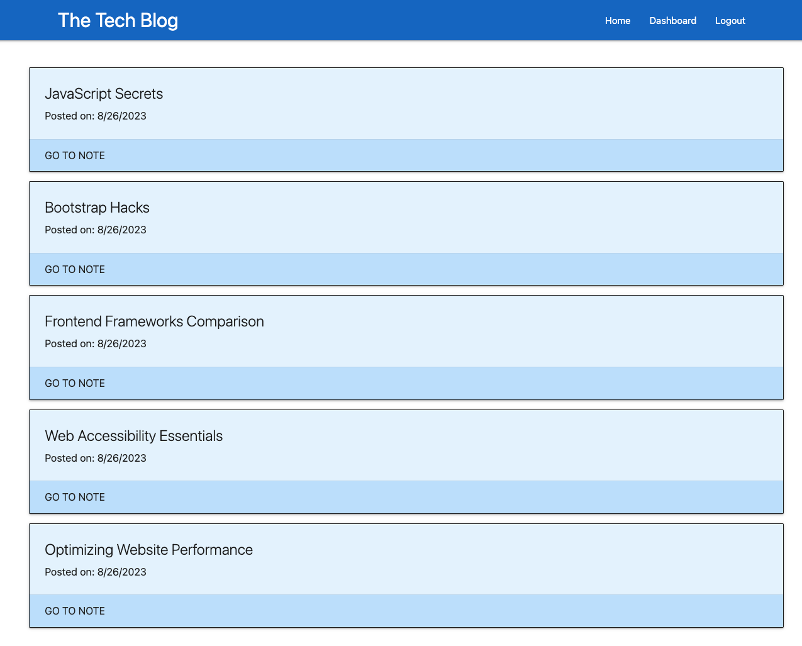
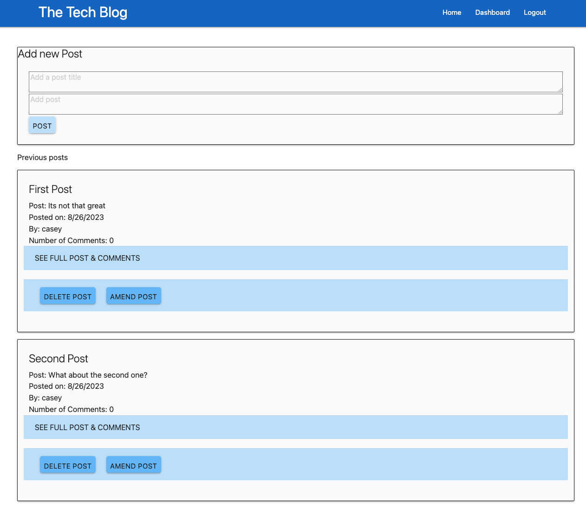
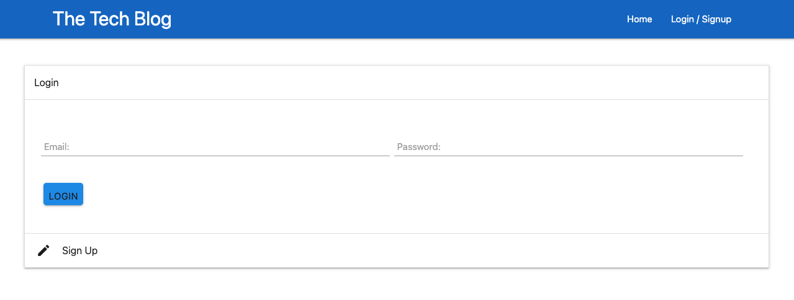

# Tech Blog 📰

Welcome to the Tech Blog! This is a web application that allows users to share their thoughts, insights, and discussions about various technology-related topics.

## Link to deployed application

Link to deployed application: https://protected-mesa-64440-be1b5b7fac6f.herokuapp.com/

## Usage

Welcome to the Tech Blog! This web application allows users to create, view, update, and delete their own blog posts. Users can also leave comments on each post to engage in discussions.

### Getting Started

To get started with the Tech Blog, follow these steps:

1. **Installation**: Clone this repository to your local machine using the following command:

   ```
   git clone https://github.com/your-username/tech-blog.git
   ```

2. **Install Dependencies**: Navigate to the project directory and install the required dependencies by running:

   ```
   npm install
   ```

3. **Database Setup**: Set up your database configuration by creating a `.env` file in the root directory and providing your MySQL credentials:

   ```
   DB_NAME=your_db_name
   DB_USER=your_db_user
   DB_PW=your_db_password
   ```

4. **Database Initialization**: Run the following command to initialize the database schema and seed data:

   ```
   npm run seed
   ```

5. **Start the Application**: Once everything is set up, start the application using:

   ```
   npm start
   ```

6. **Access the Application**: Open your web browser and navigate to `http://localhost:3001` to access the Tech Blog.

### Using the Tech Blog

- **User Authentication**: Register or log in to your account to access the full functionality of the Tech Blog.

- **Dashboard**: After logging in, you will be taken to your dashboard where you can view, create, update, and delete your blog posts. Each post will display the title, content, author, creation date, and number of comments.

- **Creating a Post**: To create a new blog post, click on the "Add new Post" card on the dashboard. Enter the title and content for your post and click the "Post" button.

- **Viewing Posts**: Click on a post's title to view the full content of the post and its associated comments.

- **Updating a Post**: On your dashboard, click the "Amend Post" button under the post you want to update. Modify the title and content as needed, then click the "Update" button.

- **Deleting a Post**: To delete a post, click the "Delete Post" button on the post card within your dashboard.

- **Adding Comments**: When viewing a post, you can leave comments by typing in the comment box and clicking the "Submit" button. Your comments will be displayed below the post.


## Features

- User authentication: Register and login to create, edit, and delete your posts.
- Create and edit posts: Share your thoughts on various technology topics.
- Comment system: Engage in discussions by commenting on posts.
- Dashboard: Access your posts and manage your content.

## Technologies Used

- Node.js
- Express.js
- Sequelize (ORM)
- Handlebars (View engine)
- MySQL or PostgreSQL (Database)
- Bcrypt (Password hashing)
- Express-Session (User sessions)
- Materialize (CSS framework)

## License

This project is licensed under the [MIT License](LICENSE).

### Screenshots





## Contact

Feel free to reach out if you have any questions or suggestions! 🚀